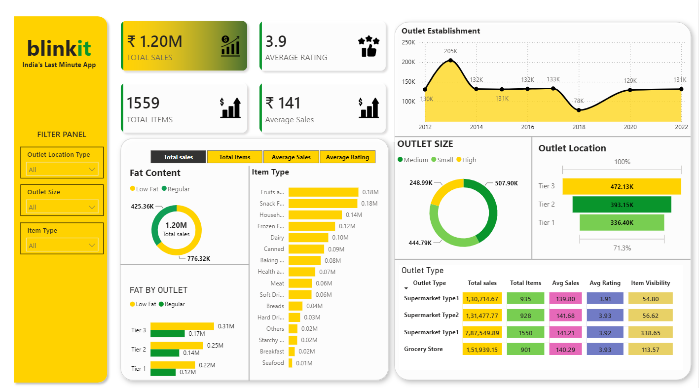
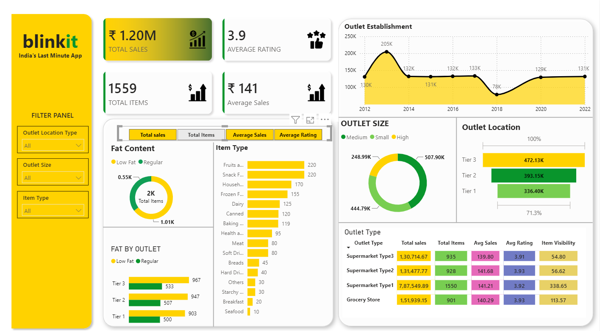
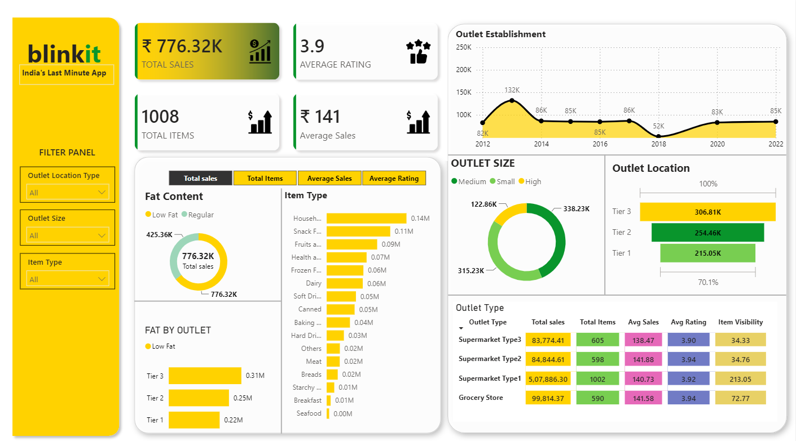
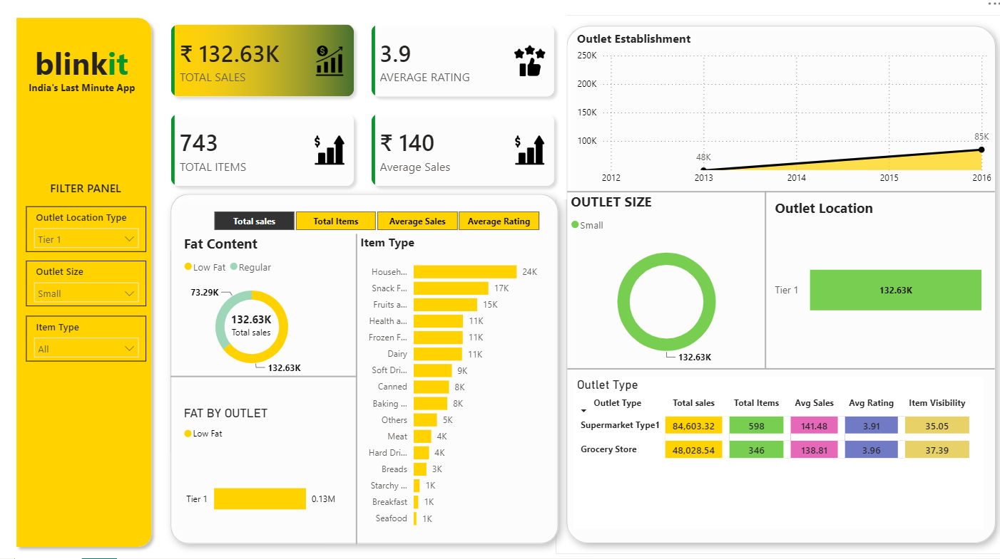

# 🛒 Blinkit Analytics Dashboard

## 📌 Overview
This repository contains a comprehensive **Blinkit Analytics Dashboard** built using Power BI. The dashboard provides deep insights into sales performance, outlet characteristics, and item-level metrics for India's Last Minute App. It empowers stakeholders to make data-driven decisions by visualizing key metrics like total sales, average ratings, and total items sold across different outlet sizes, locations, and item types.

## 🚀 Key Features
- **Overall Performance Metrics**: Track Total Sales, Average Rating, Total Items, and Average Sales at a glance.
- **Dynamic Filtering**: Interactive filter panel allows filtering data by Outlet Location Type, Outlet Size, and Item Type.
- **Fat Content Analysis**: Donut charts and bar charts analyzing sales and item counts based on Fat Content (Low Fat vs. Regular).
- **Item Type Breakdown**: Detailed horizontal bar charts showcasing performance across various item categories (Fruits, Snacks, Dairy, etc.).
- **Outlet Establishment Trends**: Line chart depicting the growth and trends of outlet establishments over the years (2012-2022).
- **Outlet Demographics**: Visualizations for Outlet Size distributions and Outlet Location (Tier 1, Tier 2, Tier 3) performance.
- **Detailed Tabular View**: Granular data table breaking down metrics by specific Outlet Types (Supermarket Type1, Grocery Store, etc.).

## 📊 Dashboard Previews

### 1. Overall Dashboard View
An overview of the complete dashboard displaying the main metrics.

### 2. Metric Interactions
The dashboard allows focusing on different metrics such as Total Items, dynamically updating the visuals.

### 3. Filtered Drill-down
Dynamic filtering and drill-down capabilities update the charts to reflect specific subsets of data.

### 4. Specific Outlet Analysis
Example of applying specific filters (e.g., Tier 1 Location, Small Outlet Size) to analyze targeted performance.

## 🛠️ Tech Stack
- **Power BI** (`.pbix` file included)

## 📂 Repository Contents
- `blinkit_dashboard.pbix`: The source Power BI project file.
- `SS1.png` - `SS4.png`: Dashboard screenshots.
- `README.md`: Project documentation.